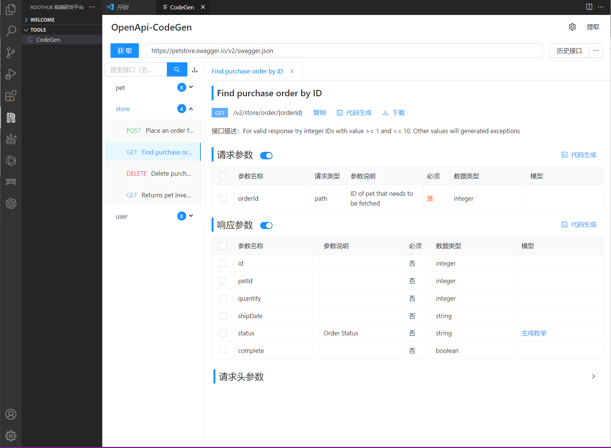

# RootHub VSCode 插件

**RootHub 前端研发平台**

## Features

- RootHub 物料平台
  - http://roothub.leekhub.com/
- CodeGen-OpenApi
  - swagger-ui2.0接口文档模式平替，功能升级api、字段、名称一键复制
  - 支持OpenApi内容格式的json、yaml文件解析成接口文档
  - api请求、枚举、Typescript定义、Table 列配置代码生成，且支持在线自定义
  - 粘贴截图一键文字提取，结合接口文档快捷生成代码

## TODO

- WIP……
- 在线简易接口连接
- 欢迎提建议

## Screenshots

### CodeGen 工具

## Development QuickStart

插件开发阅读文档： `./vsc-extension-quickstart.md`

工具应用开发采用 `git submodule` 解耦的方式，工具应用单独仓库&单独开发维护，插件打包时会对工具应用分别进行构建打包成静态资源加载。

如果工具应用需要和插件通信，则需要开发环境下进行联调，具体参考 roothub-codegen 工具开发的说明
